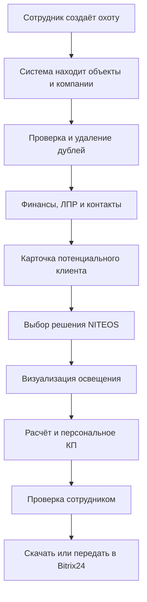
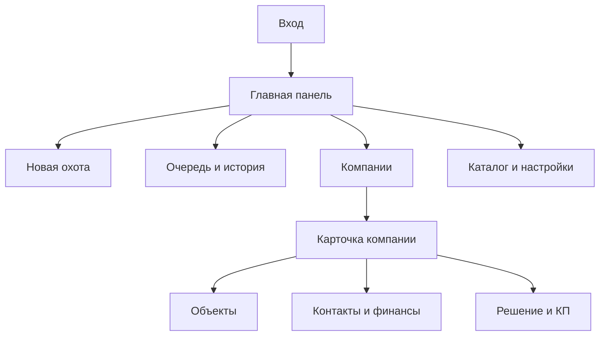

# NITEOS «Охота» — карта продукта и техническое задание

## 1. Главная задача

Разработать самостоятельное веб-приложение для сотрудников NITEOS, которое:

1. Находит потенциальных B2B-клиентов и принадлежащие им объекты.
2. Проверяет компанию, её деятельность, финансы и актуальность.
3. Находит публичные рабочие контакты компании и возможных ЛПР.
4. Сохраняет компанию в единой базе и не создаёт её повторно.
5. Находит фотографии здания или объекта.
6. Определяет, какое решение NITEOS можно предложить.
7. Создаёт предварительную визуализацию освещения.
8. Формирует персональное коммерческое предложение.
9. Позволяет сотруднику проверить, исправить и скачать КП.
10. В дальнейшем передаёт выбранную компанию и документы в Bitrix24.

Это не CRM и не набор из пяти отдельных программ. Это один сервис с единым интерфейсом, базой и очередью поисковых заданий («охот»).

## 2. Контекст NITEOS

NITEOS — российский производитель светодиодных светильников. Основные направления:

- архитектурное освещение;
- промышленное освещение;
- уличное освещение;
- спортивное освещение;
- торговое и офисное освещение;
- освещение складов, ЖКХ и АЗС;
- взрывозащищённое освещение;
- проектирование и модернизация;
- светотехнический расчёт;
- подбор аналогов и оборудования.

Основной сайт: https://niteos.ru/

Первая версия продукта должна быть оптимизирована под архитектурное и промышленное освещение. Архитектурный сценарий приоритетный, потому что позволяет показать фотографию здания, предварительный вариант подсветки и визуально убедительное КП.

## 3. Основной пользовательский сценарий



## 4. Структура веб-приложения

### 4.1. Авторизация

- Вход по email и паролю.
- Роли: администратор, менеджер, наблюдатель.
- Администратор управляет пользователями, источниками, ценами и настройками.

### 4.2. Главная панель

Показывает:

- активные охоты;
- количество найденных компаний;
- новые перспективные клиенты;
- компании без найденных контактов;
- готовые КП;
- компании, взятые в работу;
- последние действия сотрудников.

Главная кнопка: **«Начать новую охоту»**.

### 4.3. Новая охота

Два режима создания запроса.

#### Быстрые фильтры

- направление освещения;
- тип объекта;
- ОКВЭД;
- город, регион, несколько регионов или вся Россия;
- количество требуемых результатов;
- минимальная выручка;
- только действующие компании;
- обязательно наличие сайта;
- обязательно наличие контактов;
- обязательно наличие фотографии объекта.

Типы объектов:

- завод;
- производственная площадка;
- склад или логистический комплекс;
- магазин или торговый центр;
- ПВЗ;
- бизнес-центр;
- жилой комплекс;
- гостиница;
- АЗС;
- спортивный объект;
- школа, вуз или медицинское учреждение;
- общественное или административное здание;
- произвольный тип.

#### Запрос обычным языком

Пример:

> Найди 50 действующих складских комплексов в Татарстане с выручкой от 100 млн рублей, собственным зданием, фотографиями и доступными контактами руководства.

LLM преобразует текст в структурированные фильтры. Перед запуском пользователь видит распознанные параметры и может их исправить.

### 4.4. Очередь охот

Каждая охота имеет состояния:

- черновик;
- поставлена в очередь;
- выполняется;
- приостановлена;
- завершена;
- завершена с ошибками;
- отменена.

В интерфейсе показываются прогресс и статистика:

- найдено кандидатов;
- проверено;
- отклонено;
- обнаружено дублей;
- сохранено новых компаний;
- найдено контактов;
- найдено фотографий;
- готово к генерации КП.

Очередь работает в фоне. Закрытие страницы не останавливает поиск.

### 4.5. Список компаний

Отображение таблицей и карточками. Основные поля:

- фотография объекта;
- название компании;
- ИНН;
- регион и адрес;
- тип объекта;
- выручка и прибыль;
- статус компании;
- ФИО руководителя или ЛПР;
- наличие телефона, email, сайта и социальных сетей;
- рейтинг перспективности;
- предлагаемое направление NITEOS;
- статус работы;
- дата первого и последнего обнаружения.

Фильтры и сортировка:

- рейтинг;
- регион;
- тип объекта;
- направление освещения;
- выручка;
- наличие контактов;
- наличие фотографии;
- статус работы;
- источник и охота.

Массовые действия:

- взять в работу;
- сменить статус;
- сформировать КП;
- выгрузить в CSV/XLSX;
- передать в Bitrix24 (после подключения).

### 4.6. Карточка компании

Карточка состоит из вкладок.

#### Обзор

- название и краткое описание;
- ИНН/ОГРН;
- юридический и фактический адрес;
- статус деятельности;
- ОКВЭД;
- сайт;
- источник и дата проверки;
- рейтинг и обоснование;
- предлагаемое решение NITEOS;
- ответственный сотрудник;
- история статусов.

#### Объекты

- адрес объекта;
- карта;
- фотографии;
- источник каждой фотографии;
- предполагаемый тип и назначение здания;
- этажность и примерные размеры, если возможно определить;
- уровень уверенности оценки;
- комментарии сотрудника.

#### Финансы

- выручка по годам;
- прибыль/убыток;
- динамика;
- приблизительная платёжеспособность;
- дата и источник данных;
- предупреждение, если данные устарели или отсутствуют.

#### Контакты

- ФИО;
- должность;
- предполагаемая роль в принятии решения;
- рабочий телефон;
- рабочий email;
- сайт;
- ВКонтакте и другие публичные каналы;
- источник каждого значения;
- статус проверки: подтверждён, вероятен, не подтверждён, неактуален;
- рекомендация: кому и куда лучше написать.

Использовать только открытые, официальные или лицензированные источники. Не использовать утечки персональных данных.

#### Решение и КП

- проблема или возможность клиента;
- выбранное направление освещения;
- рекомендуемые продукты;
- исходная фотография;
- сгенерированная визуализация;
- ориентировочная спецификация;
- предварительная стоимость;
- редактор текста КП;
- скачать PDF;
- сохранить новую версию;
- журнал версий.

### 4.7. Каталог и цены NITEOS

Администратор может создавать и редактировать:

- категории решений;
- модели светильников;
- характеристики;
- единицу расчёта: штука, метр, комплект;
- закупочную стоимость;
- продажную стоимость;
- стоимость монтажа;
- дополнительные коэффициенты;
- гарантийный срок;
- ссылки на страницу товара, документы и IES-файлы.

До получения внутреннего прайса использовать тестовые цены с явной отметкой «демонстрационные данные».

## 5. Поиск и обогащение данных

Система строится как конвейер с независимыми шагами:

1. Интерпретация запроса пользователя.
2. Поиск объектов и организаций.
3. Нормализация названий и адресов.
4. Определение юридического лица.
5. Проверка статуса и деятельности.
6. Получение финансовых данных.
7. Поиск сайта и публичных страниц.
8. Поиск рабочих контактов и возможных ЛПР.
9. Поиск фотографий и картографических данных.
10. Проверка релевантности клиента.
11. Проверка на дубль.
12. Сохранение или обновление карточки.
13. Подбор предложения NITEOS.

Каждое поле должно хранить источник, дату получения и уровень уверенности. LLM не имеет права выдумывать отсутствующие контакты, финансовые данные, адреса или должности.

Потенциальные классы источников:

- официальный сайт компании;
- ЕГРЮЛ и официальные государственные данные;
- лицензированные сервисы финансовой информации;
- поисковые системы;
- Яндекс Карты, 2ГИС, Google Maps или другие картографические API;
- публичные страницы ВКонтакте и других площадок;
- легальные B2B-провайдеры контактов.

Интеграции должны быть заменяемыми и отключаемыми. Отсутствие одного источника не должно останавливать всю охоту.

## 6. Дедупликация и история

Основной идентификатор юридического лица — ИНН. Дополнительные признаки:

- ОГРН;
- нормализованное название;
- домен сайта;
- телефон;
- email-домен;
- нормализованный адрес;
- координаты объекта.

При совпадении система не создаёт новую компанию. Она:

1. Добавляет новую охоту в историю обнаружений.
2. Обновляет более свежие сведения.
3. Не перезаписывает подтверждённые данные менее надёжными.
4. Показывает сотруднику, что компания уже существует.

Необходимо различать юридическое лицо и объект. Одна компания может владеть несколькими зданиями, а одно здание может быть связано с несколькими организациями.

## 7. Рейтинг перспективности

Рейтинг 0–100 должен состоять из объяснимых факторов:

- соответствие типу целевого объекта;
- соответствие направлению NITEOS;
- действующий статус компании;
- выручка и прибыль;
- рост или устойчивость;
- наличие объекта;
- наличие качественных фотографий;
- доступность ЛПР;
- наличие подтверждённых контактов;
- предполагаемый масштаб проекта;
- наличие явного повода для обращения.

Пользователь всегда видит не только балл, но и объяснение, например:

> 82/100: действующий логистический комплекс, выручка растёт, найден технический директор и рабочий email, доступны фотографии фасада; точные размеры объекта не подтверждены.

## 8. Предварительная визуализация освещения

Сценарий:

1. Система предлагает найденные фотографии объекта.
2. Сотрудник выбирает подходящую фотографию или загружает свою.
3. Выбирает стиль: контурный, акцентный, заливающий, функциональный или автоматический подбор.
4. Генератор создаёт вариант ночного освещения с сохранением архитектуры здания.
5. Оригинал и результат показываются рядом.
6. Сотрудник утверждает результат или создаёт новый вариант.

Визуализация является концепцией, а не точным светотехническим расчётом. Нельзя изменять форму здания, количество этажей, вывески и ключевые архитектурные элементы без явного запроса.

## 9. Предварительный расчёт

Система может оценить:

- длину световых линий;
- примерное количество прожекторов;
- число оконных или фасадных акцентов;
- количество оборудования;
- стоимость оборудования;
- ориентировочный монтаж;
- итоговый диапазон цены;
- предполагаемую валовую прибыль.

Если точных размеров нет, показывать диапазон и уровень уверенности. Во всех документах использовать формулировку:

> Предварительная оценка. Итоговая спецификация и стоимость определяются после получения исходных данных, обследования объекта и светотехнического расчёта.

## 10. Генератор КП

КП создаётся только по сохранённой карточке и использует подтверждённые данные.

Структура:

1. Логотип и данные NITEOS.
2. Персональное обращение.
3. Краткое описание объекта и найденной возможности.
4. Предложенное решение.
5. Исходная фотография и предварительная визуализация.
6. Рекомендуемая продукция.
7. Ориентировочная спецификация и диапазон стоимости.
8. Преимущества NITEOS, релевантные этому клиенту.
9. Следующий шаг: консультация, обследование или бесплатный расчёт.
10. Контакты NITEOS.
11. Юридическая оговорка о предварительном характере оценки.

Текст можно редактировать. Хранить версии КП, автора, время создания и исходные данные. PDF должен выглядеть как профессиональное коммерческое предложение, а не как технический отчёт.

## 11. Визуальный стиль интерфейса

Направление: современный B2B-инструмент, визуально связанный с темой света и производством NITEOS.

- тёмный графитовый фон для навигации;
- светлые рабочие поверхности;
- акцентные электрический синий и тёплый световой жёлтый;
- крупные фотографии объектов;
- понятные статусы и рейтинги;
- минимум декоративных эффектов;
- плотный, но не перегруженный интерфейс;
- адаптация под ноутбук и планшет;
- мобильный режим для просмотра карточек.

Основной ориентир — рабочий кабинет для отдела продаж, а не рекламный лендинг.

### Карта экранов



## 12. Предлагаемая техническая архитектура

Конкретный стек можно скорректировать после анализа окружения. Рекомендуемый вариант:

- frontend: React/Next.js + TypeScript;
- UI: Tailwind CSS или собственная дизайн-система;
- backend API: FastAPI/Python;
- основная база: PostgreSQL;
- фоновая очередь: Redis + Celery/RQ;
- хранение изображений и PDF: S3-совместимое объектное хранилище;
- авторизация: безопасные серверные сессии;
- LLM: абстрактный провайдер через отдельный сервисный слой;
- генерация изображений: отдельный адаптер;
- PDF: серверный HTML-шаблон с рендерингом;
- интеграции: отдельные адаптеры для каждого внешнего источника;
- журналирование: события охоты и действий пользователя.

Для демонстрационной локальной версии разрешается SQLite и встроенная очередь, но код должен позволять переход на PostgreSQL и Redis без переписывания бизнес-логики.

## 13. Основные сущности базы

- users;
- hunts;
- hunt_filters;
- hunt_events;
- companies;
- company_financials;
- company_sources;
- company_contacts;
- people;
- properties/buildings;
- building_images;
- company_building_relations;
- product_catalog;
- lighting_solutions;
- visualizations;
- proposals;
- proposal_versions;
- activity_log;
- integration_exports.

## 14. Этапы разработки

### Этап 1. Каркас продукта

- структура проекта;
- база данных;
- авторизация;
- навигация;
- экраны охот и компаний;
- демонстрационные данные.

### Этап 2. Рабочая охота

- создание запроса;
- очередь;
- адаптеры источников;
- нормализация;
- дедупликация;
- карточки и история.

### Этап 3. Обогащение

- юридические сведения;
- финансы;
- сайты;
- контакты;
- ЛПР;
- фотографии и карты;
- проверка и рейтинг.

### Этап 4. Решение NITEOS

- каталог;
- правила подбора;
- анализ объекта;
- предварительный расчёт;
- визуализация.

### Этап 5. КП

- шаблоны;
- редактор;
- версионность;
- PDF;
- массовая генерация при необходимости.

### Этап 6. Эксплуатация

- Bitrix24;
- роли и аудит;
- мониторинг ошибок;
- развёртывание;
- резервное копирование.

## 15. Первая демонстрационная версия

Первая версия должна давать полный сквозной сценарий на реальных или демонстрационных источниках:

1. Пользователь создаёт охоту.
2. Очередь отображает выполнение.
3. В списке появляются компании без дублей.
4. Открывается подробная карточка.
5. Видны сведения, контакты, источники и фотография.
6. Система объясняет релевантность.
7. Пользователь создаёт визуализацию.
8. Система формирует редактируемое КП.
9. КП скачивается в PDF.

Если внешний сервис ещё не подключён, использовать явно отмеченный mock-адаптер. Нельзя имитировать подключение и выдавать демонстрационные сведения за проверенные реальные данные.

## 16. Критерии готовности MVP

- приложение запускается одной понятной командой или через Docker Compose;
- присутствует `.env.example` без секретов;
- есть инструкция запуска;
- охота продолжает работу после закрытия страницы;
- одна компания не создаётся повторно;
- каждое найденное поле имеет источник и дату;
- отсутствующие данные не выдумываются;
- пользователь может исправлять сведения;
- поиск, карточка и КП работают сквозным сценарием;
- PDF открывается и корректно отображается;
- ошибки внешних источников не ломают всю охоту;
- тестовые данные явно обозначены;
- код разделён на бизнес-логику, интеграции, API и интерфейс;
- есть базовые автоматические тесты дедупликации и генерации КП.

## 17. Что не входит в первый MVP

- полноценная замена CRM;
- автоматическая рассылка без проверки человеком;
- автоматический точный проект освещения без исходных чертежей;
- гарантированное определение размеров по одной фотографии;
- использование незаконных баз персональных данных;
- самостоятельное заключение сделки системой;
- управление производственным цехом.

## 18. Материалы, которые желательно добавить в папку проекта

```text
project/
├── NITEOS_HUNT_PRODUCT_SPEC.md
├── assets/
│   ├── brand/              # логотипы, цвета, шрифты
│   ├── buildings/          # фотографии объектов для теста
│   ├── completed-projects/ # реализованные проекты NITEOS
│   └── proposal/           # пример настоящего КП
├── data/
│   ├── products.xlsx       # каталог и цены
│   ├── target-clients.xlsx # примеры хороших клиентов
│   └── demo-companies.csv  # тестовые компании
└── docs/
    ├── integrations.md     # доступные API и ограничения
    └── deployment.md       # где будет размещаться продукт
```

Секретные ключи нельзя помещать в документацию или коммитить. Они хранятся только в локальном `.env` или защищённом хранилище окружения.

## 19. Инструкция для Codex

> Изучи `NITEOS_HUNT_PRODUCT_SPEC.md` целиком. Сначала проверь существующий код и опиши, какие компоненты можно использовать без риска. Затем составь короткий план реализации MVP и приступай к разработке. Не превращай продукт в Telegram-бота или полноценную CRM. Главный результат — запускаемое веб-приложение со сквозным сценарием «охота → компания → проверенные данные → объект → визуализация → КП». Все заглушки и тестовые данные обозначай явно. После каждого этапа запускай проверки и показывай работающий результат.

